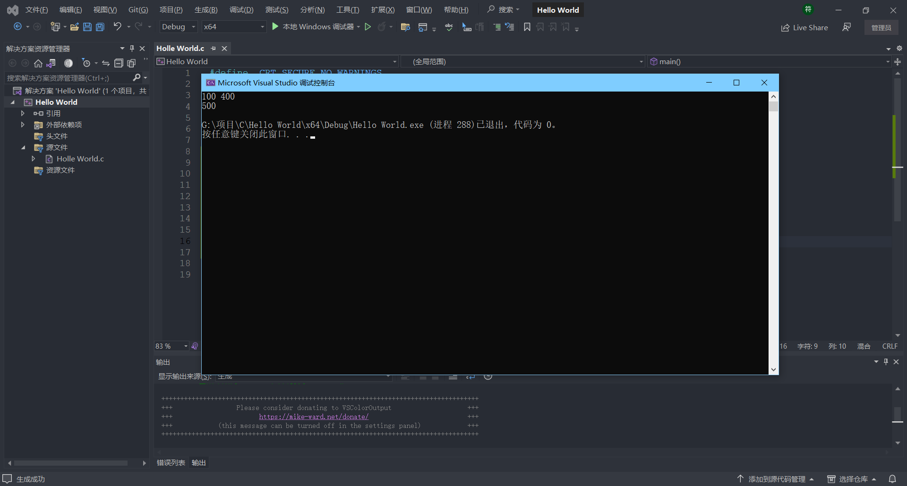

# 变量-常量-局部变量-全局变量

## 变量和常量

生活中的有些值是不变的(比如:圆周率,性别,身份证号码,血型等等)

有些值是可变的(比如:年龄,体重,薪资)

不变的值,C语言中用常量的概念来表示,变得值C语言中用变量来表示

### 变量

变量分为:局部变量和全局变量

```C
// 全局变量-在{}外定义的变量
int test = 30
int main() {
    // 局部变量-在{}内定义的变量
    int test = 20;
    return 0;
}
```

> [!TIP]
> 当全局变量和局部变量名字相同的情况下,局部变量优先
>
> 但是不建议名字重复

例子:

```C
#define _CRT_SECURE_NO_WARNINGS
#include <stdio.h>

int main() {
    //初始化变量
    int num1 = 0;
    int num2 = 0;
    //输入2个整数
    scanf("%d %d", &num1, &num2);
    //求和
    int sum = num1 + num2;
    //输出
    printf("%d\n", sum);
    return 0;
}
```



#### 变量的作用域

作用域(scope)是程序设计概念,通常来说,一段程序代码中所用到的名字并不总是有效/可用的

而限定这个名字的可用性的代码范围就是这个名字的作用域.

##### 局部变量

局部变量的作用域就是变量所在的局部范围.

##### 全局变量

全局变量的作用域就是整个项目.

```C
//声明其他文件里的变量
extern int a;
extern <函数类型> [函数名称];
```

#### 生命周期

变量的生命周期指的是变量的创建到变量的销毁之间的一个时间段.

##### 局部变量

局部变量的生命周期是:进入作用域生命周期开始,出作用域生命周期结束.

##### 全局变量

全局变量的生命周期是:整个程序的生命周期.

## 常量

C语言中的常量和变量的定义的形式有所差异.

C语言中的常量分为以下几种:

* 字面常量
* `const` 修饰的常变量
* `#define` 定义的标识符常量
* 枚举常量

例子

```C
int main(){
    // 1.字面常量
    30;
    3.14;
    'w';
    "abc";

    // 2.const 修饰的常变量:本质是变量,但是不能被修改,有常量的属性
    a = 20;
    b = 40;

    // 3.#define 定义的标识符常量
    #define MAX 100
    #define aa 200

    // 4.枚举常量
    // 三原色RGB(Red Green Blue)
    enum Color{
        Red,
        Green,
        Blue
    }
    enum Color a = Red
    return 0;
}
```