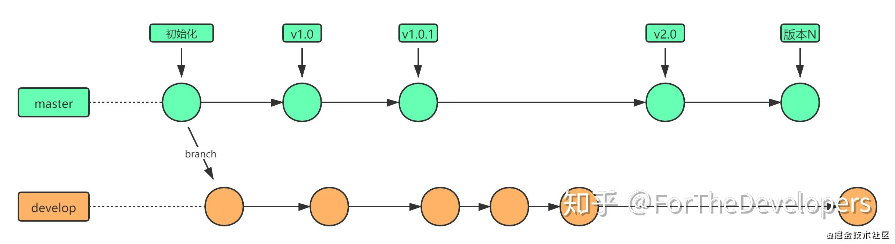
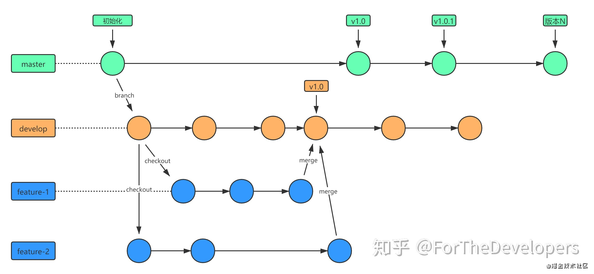
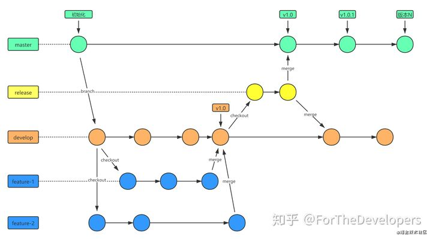
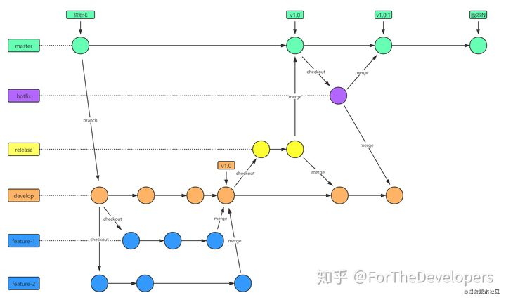

# GitFlow工作流

## 主分支流程

master分支记录了每次版本发布历史和tag标记.
develop分支记录了所有开发的版本历史.
develop分支仅第一次创建时从master分支拉取.

## 开发

feature分支是从develop分支拉取的分支.
每个feature完成后需合并到develop分支.

## 提测发布流程

release分支是在所有功能开发自测完成后,从develop分支拉取的分支.
release分支一旦创建后,通常不再从develop分支拉取,该分支只做bug修复,文档生成和其他面向发布的任务.
release分支测试完成,达到上线标准后,需合并回master分支和develop分支.

## bug修复流程

hotfix分支是在线上出现bug之后,从master分支拉取的分支.
hotfix分支测试完成后,需合并回master分支和develop分支.

