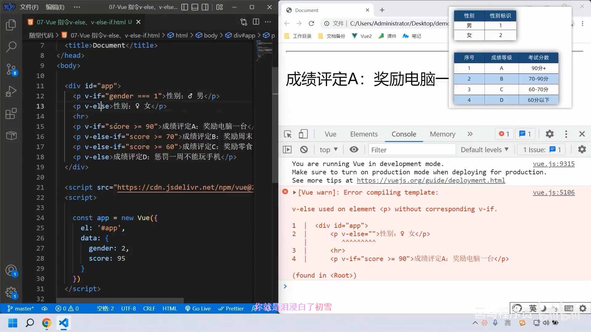

# Vue 指令

Vue 会根据不同的 **指令** ,针对标签实现不同的 **功能**

指令: 带有 **V- 前缀** 的特殊**标签属性**

## v-html

### 作用

设置元素的 `innerHTML`

### 语法

`v-html = "表达式"`

### 例子

```html
<div id="app">
	<div v-html="msg"></div>
</div>

<script src="https://cdn.jsdelivr.net/npm/vue@2.7.14/dist/vue.js"></script>

<script>
	const app = new Vue({
		el: '#app',
		data: {
			msg:
			`
				<a href="http://www.itheima.com"
					黑马程序员
				a>
			`
		}
	})
</script>
```

## v-show

### 作用

控制元素显示隐藏

### 语法

`v-show = "表达式"` 表达式值 `true` 显示,`false` 隐藏

### 原理

**切换 `display:none`** 控制显示隐藏

### 场景

频繁切换显示隐藏的场景

## v-if

### 作用

控制元素显示隐藏(**条件渲染`**)

### 语法

`v-if = "表达式"` 表达式值 `true` 显示,`false` 隐藏

### 原理

基于**条件判断**,是否 **创建** 或 **移除** 元素节点

### 场景

要么显示,要么隐藏,不频繁切换的场景

## v-else v-else-if

### 作用

辅助v-if进行判断渲染

### 语法

`v-else` `v-else-if ="表达式"`

### 注意

需要紧挨着 `v-if` 一起使用



## v-on

### 作用

注册事件 = 添加监听 + 提交处理逻辑

### 语法

1. `v-on:事件名 = "内联语句"`
2. `v-on:事件名 = "methods中的函数名"`

### 简写

`v-on:` 整个替换成 `@` 如 `@click = "count++"`

### 原理

**切换 `display:none`** 控制显示隐藏

### methods

```html
<div id="app">
	<button @click="fn">切换显示隐藏</button>
	<h1 v-show="isShow">test</h1>
</div>

<script src="https://cdn.jsdelivr.net/npm/vue@2.7.14/dist/vue.js"></script>

<script>
	const app = new Vue({
		el: '#app',
		data: {
			isShow: true
		},
		methods: {
			fn () {
				// console.log('执行了fn', app.isShow)
				// app.isShow = !app.isShow
				// 换成this后,上面的变量名怎么变都不会有影响 this指向Vue实例
				this.isShow = !this.isShow
			}
		}
	})
</script>
```

### 带参

`@click = "fn(参数1, 参数2)"`

不需要写例子了吧,不会重学Js

## v-bind

### 作用

动态的设置html的标签属性 → src url title ......

### 语法

`v-bind:属性名 = "表达式"`

### 注意

简写形式: **属性名="表达式"**

## v-for

### 作用

基于 **数据** 循环,**多次** 渲染整个元素 → **数组**,对象,数字...

遍历数组语法: `v-for:"(item, index) in 数组"`
> **item** 每一项,index 下标

### 例子

```html
<div id="app">
	<h3>水果店</h3>
	<ul>
		<li v-for="(item, index) in list">
			{{ item }} - {{ index }}
		</li>
	</ul>

	<!-- 如果只有一个数据,可以省略 -->
	<ul>
		<li v-for="item in list">
			{{ item }} - {{ index }}
		</li>
	</ul>
</div>

<script src="https://cdn.jsdelivr.net/npm/vue@2.7.14/dist/vue.js"></script>

<script>
	const app = new Vue({
		el: '#app',
		data: {
			list: ['西瓜', '苹果', '鸭梨', '榴莲']
		}
	})
</script>
```

## v-for 中的key

### 语法

**key属性 = "唯一标识"**

### 作用

给列表项添加**唯一标识**.便于Vue进行列表的正确排序复用.

v-for 的默认行为会尝试**原地修改元素**(**就地复用**)

### 注意点

1. key 的值只能是 **字符串** 或 **数字类型**
2. key 的值必须具有 **唯一性**
3. 推荐使用 **id** 作为key(唯一),不推荐使用 **index** 	作为 key(会变化,不对应)

## v-model

### 作用

给 **表单元素** 使用,**双向数据绑定** → 可以快速 **获取** 或 **设置** 表单元素内容

1. 数据变化 → 视图自动更新
2. **视图**变化 → **数据**自动更新

### 语法

`v-model='变量'`

常见的表单元素,都可以用`v-model`绑定关联 → 快速 **获取** 或 **设置** 表单元素的值.
他会根据 **控件类型** 自动选取 **正确的方法** 来更新元素

如:

1. 输入框 inpu:text → value
2. 文本域 textarea → value
3. 复选框 input:checkbox → checked
4. 单选框 input:radio → checked
5. 下拉菜单 select → value
6. ...

## 实战

### 学习之旅

```html
<div id="app">
	<button v-show="index > 0" @clik="index--">上一页</button>
	<div>
		
	</div>
	<button v-show="index < list.length - 1" @clik="index++">下一页</button>
</div>

<script src="https://cdn.jsdelivr.net/npm/vue@2.7.14/dist/vue.js"></script>
<script>
	const app = new Vue({
		el: '#app',
		data: {
			index: 0,
			list: [
				'图片1'
				'图片2'
				'图片3'
				'图片4'
				'图片5'
			]
		}
	})
</script>
```

### 书架

```html
<div id="app">
	<h3>书架</h3>
	<ul>
		<li v-for="(item, index) in booksList" :key="item.id">
			<span>{{ itme.name }}</span>
			<span>{{ itme.acthor }}</span>
			<!-- 注册点击事件 -> 通过 id 进行删除数组中的 对应项 -->
			<button @click="del(itme.id)">删除</button>
		</li>
	</ul>
</div>

<script src="https://cdn.jsdelivr.net/npm/vue@2.7.14/dist/vue.js"></script>

<script>
	const app = new Vue({
		el: '#app',
		data: {
			booksList: [
				{ id: 1, name: '<红楼梦>', author: '曹雪芹' },
				{ id: 2, name: '<西游记>', author: '吴承恩' },
				{ id: 3, name: '<水浒传>', author: '施耐庵' },
				{ id: 4, name: '<三国演义>', author: '罗贯中' }
			]
		},
		methods: {
			del (id) {
				// console.log('删除', id)
				// 通过 id 进行删除数组中的 对应项,得到一个新数组.
				// console.log(this.booksList.filters(item => item.id !== id))
				this.booksList = this.booksList.filters(item => item.id !== id)
			}
		}
	})
</script>
```