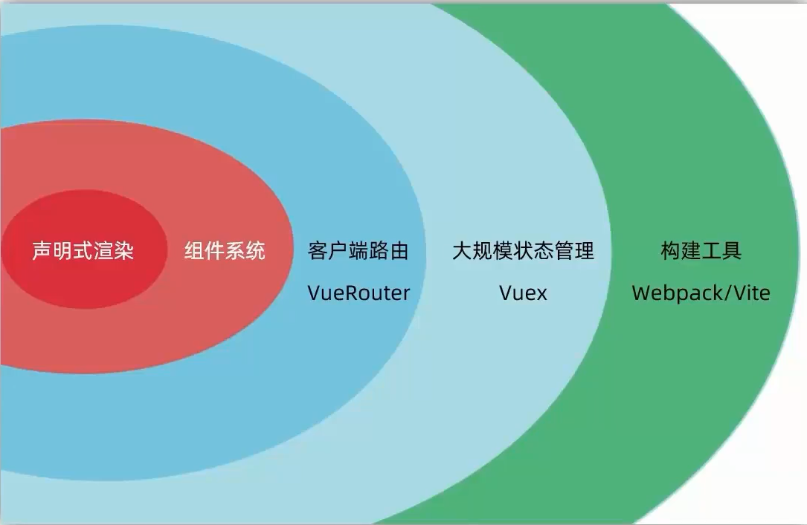

# Vue 是什么

## 概念

Vue 是一个用于 **构建用户界面** 的 **渐进式** **框架**

构建用户界面: 基于数据渲染出用户看到的页面

渐进式: 循序渐进

框架: 一套完整的项目解决方案

## Vue 的两种开发方式

1. Vue 核心包开发
   * 场景: **局部** 模块改造
2. Vue 核心包 & Vue插件 工程化开发
   * 场景: **整站** 开发

## 官方地址

[Vue V2](https://v2.cn.vuejs.org)

[Vue V3](https://cn.vuejs.org)