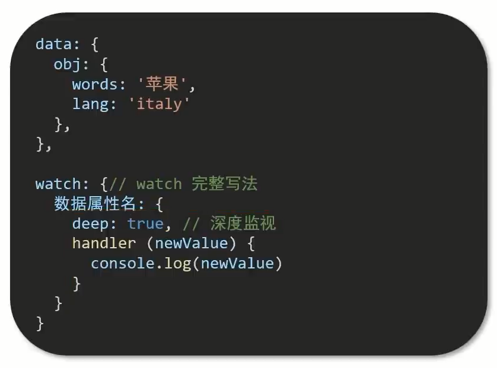

# watch 侦听器 (监视器)

## 作用

**监视数据变化**,执行一些 业务逻辑 或 异步操作.

## 语法

1. 简单写法 → 简单类型数据,直接监视
2. 完整写法 → 添加额为配置项

## 简单写法例子

```html
<div id="app">
	<div>
		<div>
			<textarea v-model="words"></textarea>
			<span><i>⌨</i>文档翻译</span>
		</div>
		<div>
			<div>{{ result }}</div>
		</div>
	</div>
</div>

<script src="https://cdn.jsdelivr.net/npm/vue@2.7.14/dist/vue.js"></script>
<!-- axios库 -->
<script src="https://cdn.jsdelivr.net/npm/axios@1.5.1/dist/axios.min.js"></script>

<script>
	const app = new Vue({
		el: '#app',
		data: {
			// words: ''
			obj: {
				words: ''
			},

			result: '' // 翻译结果
			// timer: null // 延迟器id
		},
		// 具体讲解：(1) watch语法 (2) 具体业务实现
		watch: {
			// 该方法会在数据变化时调用执行
			// newValue新值,oldValue老值(一般不用)

			// words (newValue, oldValue) {
			// 	console.log("变化了", newValue, oldValue);
			// }

			'obj.words' (newValue) {
				// console.log("变化了", newValue);

				// 防抖:延迟执行 → 干啥事先等一等,延迟一会,一段时间内,没有再次触发才执行
				clearTimeout(this.timer)
				this.timer = setTimeout(async () => {
					const res = await axios({
						url: 'https://applet-base-api-t.itheima.net/api/translate',
						params: {
							words: newValue
						}
					})
					this.result = res.data.data
					// console.log(res.data.data);
				}, 300);
			}
		}
	})
</script>
```

## 完整写法 → 添加额外 **配置项**

1. `deep： true` 对复杂类型深度监视
2. `immediate： true` 初始化立刻执行一次handler方法



## 例子

还是上面的代码
```html
<div id="app">
	<!-- 条件选择框 -->
	<div>
		<span>翻译成的语言:</span>
		<select v-model="obj.lang">
			<option value="italy">意大利</option>
			<option value="english">英语</option>
			<option value="german">德语</option>
		</select>
	</div>
	<!-- 翻译框 -->
	<div>
		<div>
			<textarea v-model="words"></textarea>
			<span><i>⌨</i>文档翻译</span>
		</div>
		<div>
			<div>{{ result }}</div>
		</div>
	</div>
</div>

<script src="https://cdn.jsdelivr.net/npm/vue@2.7.14/dist/vue.js"></script>
<!-- axios库 -->
<script src="https://cdn.jsdelivr.net/npm/axios@1.5.1/dist/axios.min.js"></script>

<script>
	const app = new Vue({
		el: '#app',
		data: {
			obj: {
				words: '',
				lang: 'italy'
			},

			result: ''
		},
		watch: {
			obj: {
				deep: true,
				// 立刻执行一次
				// immediate: true,
				handler (newValue) {
					// console.log("对象被修改了", newValue);
					clearTimeout(this.timer)
					this.timer = setTimeout(async () => {
						const res = await axios({
							url: 'https://applet-base-api-t.itheima.net/api/translate',
							parent: newValue
							// params: {
							// 	words: newValue
							// 	lang: obj.lang
							// }
						})
						this.result = res.data.data
					}, 300);
				}
			}
		}
	})
</script>
```