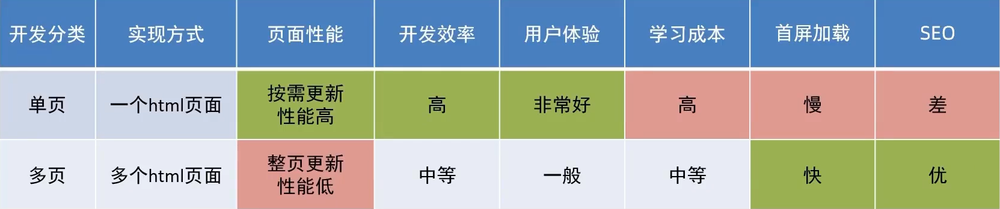

# 单页应用程序

SPA - Single Page Application

有单页就有多页

单页页面例子: 网易云音乐

多页页面例子: 京东

单页页面一般用于: 系统类网站/内部网站/文档类网站/移动端站点

多页页面一般用于: 公司官网/电商类网站

单页面应用程序,之所以开发效率高,性能高,用户体验好最大的原因就是: **页面按需更新**

要按需更新,首先就需要明确: **访问路径** 和 **组件** 的对应关系!

访问路径 和 组件的对应关系用 **路由** 来确定