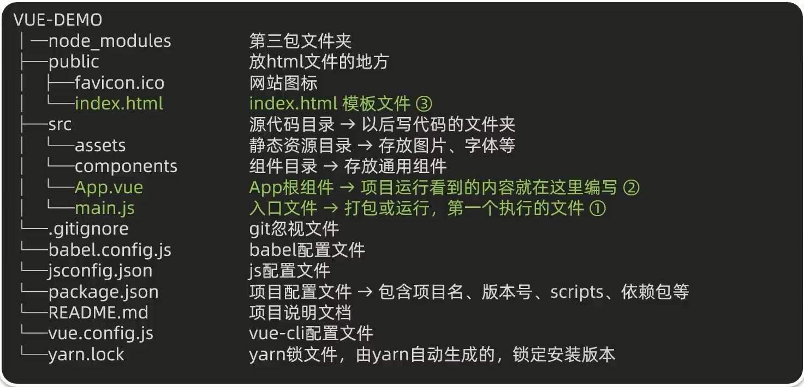

# 工程化开发&脚手架 Vue CLI

## 开发 Vue 的两种方式

1. 核心包传统开发模式： 基于 html/css/js 文件,直接引入核心包,开发Vue.
2. 工程化开发模式： 基于构建工具(例如：webpack)的环境中开发 Vue.

## 基本介绍

Vue CLI 是 Vue 官方提供的一个 **全局命令工具**.
可以帮助我们 **快速创建** 一个开发Vue项目的 **标准化基础架子**.[集成了webpack配置]

## 好处

1. 开箱即用,零配置
2. 内置 babel 等工具
3. 标准化

## 安装步骤

1. 全局安装(一次): `yarn global add @vue/cli` 或 `npm i @vue/cli -g`
2. 查看 Vue 版本： `vue --version`
3. 创建项目架子： `vue create project-name （项目名-不能用中文）`
4. 启动项目： `yarn serve` 或 `npm run serve` （找package.json）

serve 不是写死的,可以在 package.json 里设置

## 脚手架目录文件介绍 & 项目运行流程



### main.js

核心作用: 导入App.vue,基于App.vuec创建结构渲染index.html

Vue.config.productionTip
提示：当前处于什么环境(false 生产环境／true 开发环境)

`el: '#app'` 与 `$mount('app')` 作用完全一致,用于指定Vue管理的容器

`render: h => h(App),` 是简写,完整如下:

```js
// createElement 可以写成 h
render: createElement (App) => {
	return createElement(App)
}
```