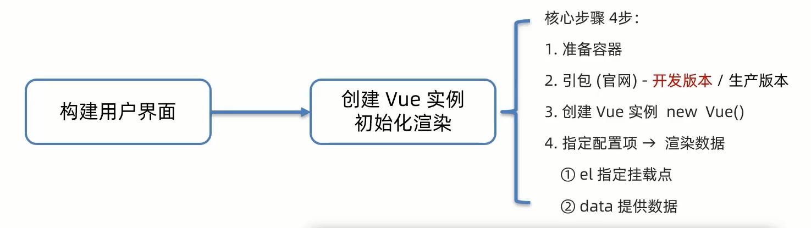

# 快速上手

## 步骤

**创建 Vue 实例,初始化渲染**



开发版本包含完整的警告和调试模式

生产版本删除了警告

```html
<div id="app">
	<h1>{{ msg }}</h1>
	<a href="#">{{ count }}</a>
</div>

<!-- 引入开发版本包 -->
<script src="https://cdn.jsdelivr.net/npm/vue@2.7.14/dist/vue.js"></script>

<script>
	const app = new Vue({
		// 通过 el 配置选择器,指定 Vue 管理的是哪个盒子
		el: '#app',
		// 通过 data 提供数据
		data: {
			msg: 'Hello World',
			count: 666
		}
	})
</script>
```