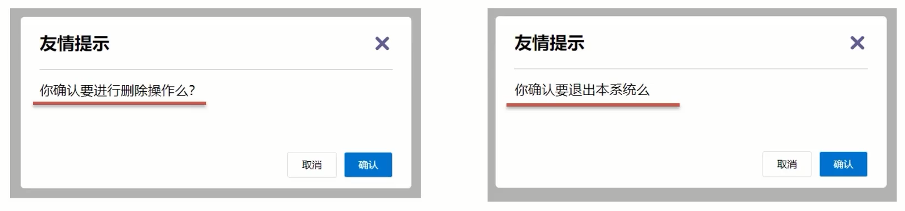

# 插槽

## 作用

让组件内部的一些 **结构** 支持 **自定义**



## 使用

1.在需要定制的位置,使用slot占位

```html
<slot></slot>
```

2.在使用组件时,组件标签内填入内容

```html
<组件>
	内容
	<p>这里面填什么都可以</p>
</组件>
```

## 设置默认值

```html
<slot>默认值</slot>
```

## 具名插槽

### 使用

1.多个slot使用name属性区分名字

```html
<div>
	<slot name="head"></slot>
</div>
<div>
	<slot name="content"></slot>
</div>
<div>
	<slot name="footer"></slot>
</div>
```

2.template配合v-slot:名字来分发对应标签

```html
<组件>
	<template v-slot:head>
		标题
	</template>
	<template v-slot:head>
		内容
	</template>
	<template v-slot:head>
		<button>按钮</button>
	</template>
</组件>
```

3.`v-slot:插槽名` 可以简化成 **#插槽名**

```html
<组件>
	<template #head>
		标题
	</template>
	<template #head>
		内容
	</template>
	<template #head>
		<button>按钮</button>
	</template>
</组件>
```

## 作用域插槽

定义slot插槽的同时是可以 **传值** 的.给 **插槽** 上可以 **绑定数据**,将来 **使用组件时可以用**.

### 场景

封装表格组件

1.父传子,动态渲染表格内容

2.利用默认插槽,定制操作列

3.删除或查看都需要用到 **当前项的 id**,属于 **组件内部的数据** 通过 **作用域插槽** 传值绑定,进而使用

### 使用

1.给slot 标签,以添加属性的方式传值

```html
<slot :id="item.id" msg="测试文本"></slot>
```

2.所有添加的属性,都会被收集到一个对象中

```js
{ id: 3, msg: '测试文本' }
```

3.在template中,通过 `#插槽名="obj"` 接收,默认插槽名为 **default**

```html
<组件 :list="list">
	<template #default="obj">
		<button @click="del(del(obj.id))">删除</button>
	</template>
</组件>
```