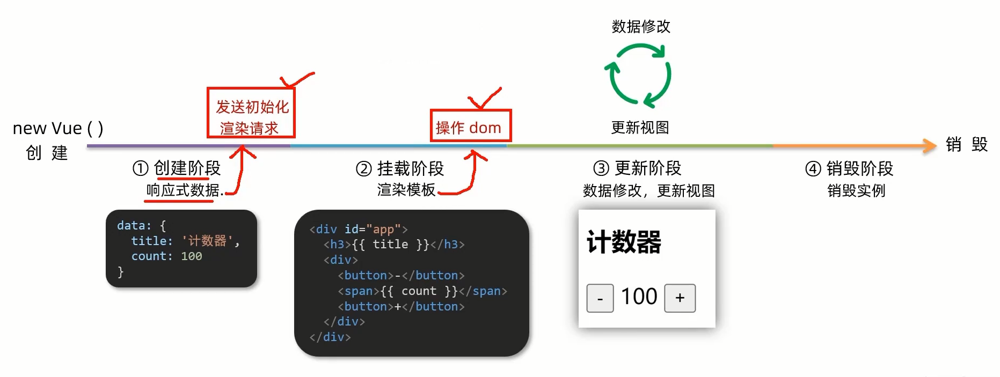
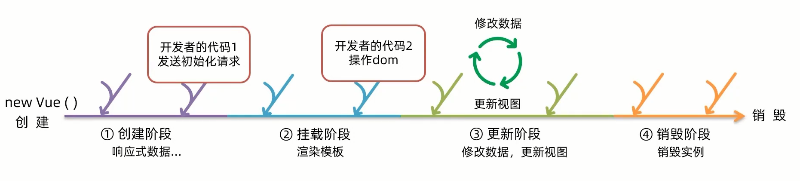
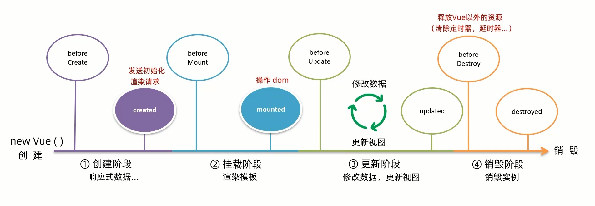

# 生命周期

## Vue生命周期

一个Vue实例从 **创建** 到 **销毁** 的整个过程.

生命周期四个阶段:

1. 创建
2. 挂载
3. 更新
4. 销毁



## Vue生命周期函数(钩子函数)

Vue生命周期过程中,会 **自动运行一些函数**,被称为 **[生命周期钩子]** → 让开发者可以在 **[特定阶段]** 运行自己的代码.





## 实例

```html
<div id="app">
	<h3>{{ title }}</h3>
	<div>
		<button @click="count--"></button>
		<span>{{ count }}</span>
		<button @click="count++">+</button>
	</div>
</div>

<script src="https://cdn.jsdelivr.net/npm/vue@2.7.14/dist/vue.js"></script>
<script>
	const app = new Vue({
		el: '#app'，
		data: {
			count: 100,
			title: '计数器'
		},
		// 1.创建阶段 (准备数据)
		beforeCreate () {
			console.log("beforeCreate 响应式数据准备好之前", this.count);
		},
		created () {
			console.log('created 响应式数据准备好之后', this.count)
		},

		// 2.挂载阶段 (渲染模板)
		beforeMount () {
			console.log('beforeMount 模板渲染之前', document.querySelector('h3').innerHTML)
		}，
		mounted () {
			console.log('mounted 模板渲染之后', document.querySelector('h3').innerHTML)
		},

		// 3.更新阶段(修改数据 → 更新视图)
		beforeUpdata () {
			console.log("beforeUpdata 数据修改了,视图还没更新", document.querySelector('span').innerHTML);
		},
		updated () {
			console.log("updated 数据修改了,视图已经更新", document.querySelector('span').innerHTML);
		}

		// 4.卸载阶段(关闭网页,官方给出了 app.$destroy() 用于手动卸载)
		beforeDestroy () {
			console.log("beforeDestroy 卸载前");
			console.log("清除掉一些Vue以外的资源占用，定时器，延时器...");
		},
		destroyed () {
			console.log("destroyed 卸载后");
		}
	})
</script>
```