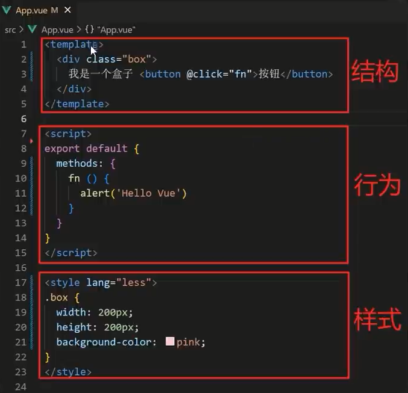

# 组件化开发 & 根组件

## 组件化：

一个页面可以拆分成 **一个个组件**,每个组件有着自己独立的 **结构、样式、行为**.
好处： 便于 **维护**,利于 **复用** →提升 **开发效率**。

## App.vue

App.vue 文件(单文件组件)的三个组成部分

1. template： 结构(有且只能一个根元素)
2. script： js逻辑
3. style：样式(可支持less,需要装包)

## 让组件支持less

1. style标签,`lang="less"` 开启 less 功能
2. 装包： `yarn add less less-loader`

## 普通组件的注册使用

组件注册的两张方法:

1. 局部注册: 只能在注册的组件内使用
   1. 创建 .vue 文件 (三个组成部分)
   2. 在使用的组件内导入并注册
2. 全局注册: 所有组件内都能所有
   1. 创建 .vue 文件 (三个组成部分)
   2. **main.js** 中进行全局注册

## 局部注册

## 全局注册

## 使用

当成html标签使用 `<组件名></组件名>`

## 注意

组件名规范 → 大驼峰命名法,如： HmHeader
