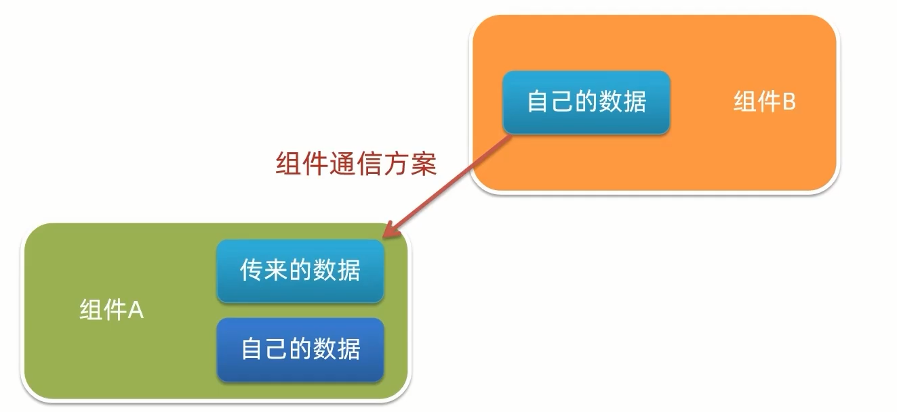
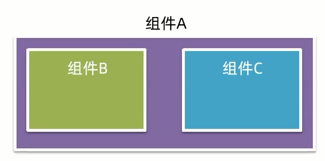
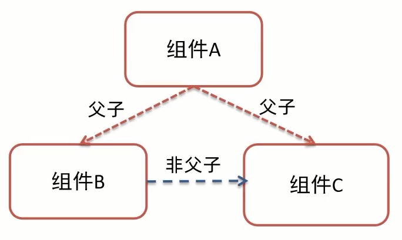
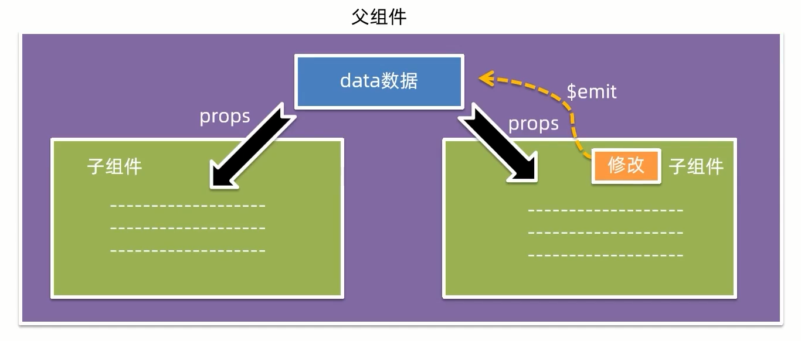
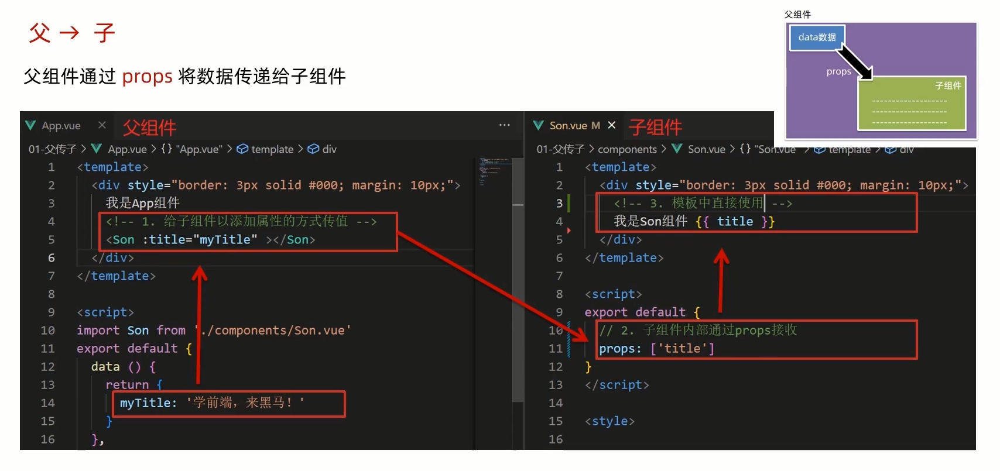
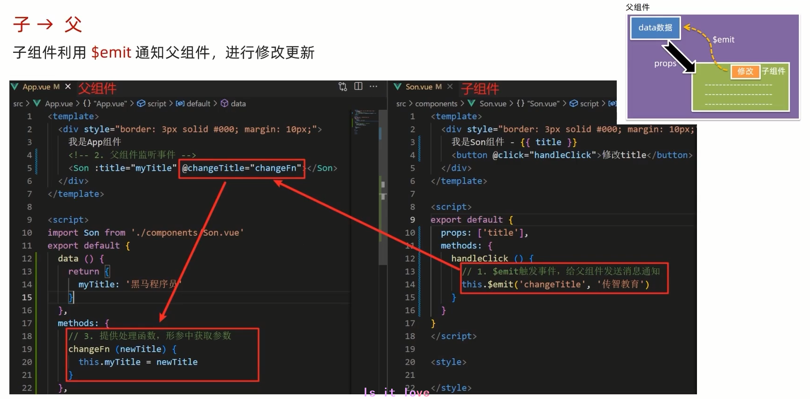
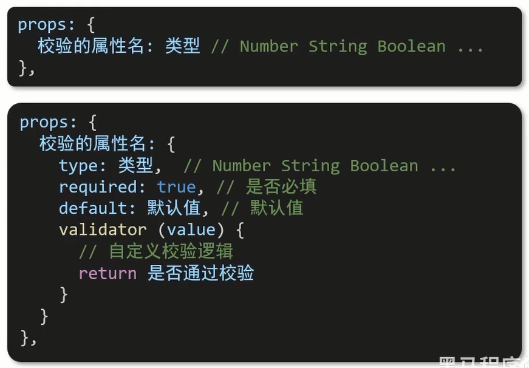
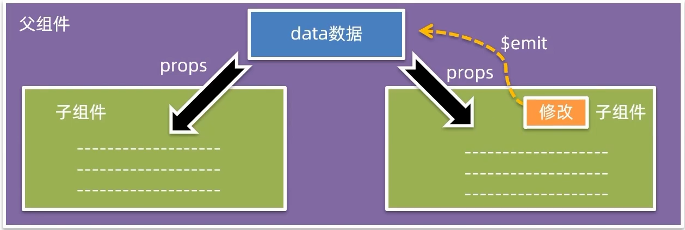
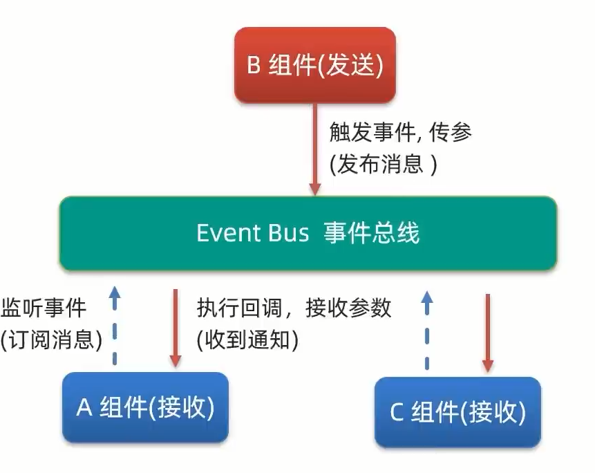
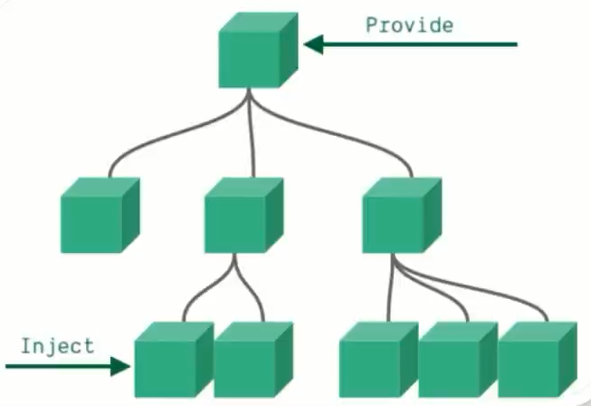

# 组件通信

组件通信,就是指 **组件与组件** 之间的 **数据传递**.

* 组件的数据是 **独立** 的,无法直接访问其他组件的数据.
* 想用其他组件的数据 → 组件通信



## 不同的组件关系 和 组件通信方案分类

### 组件关系分类

1. 父子关系
2. 非父子关系




### 组件通信解决方案

1. 父子关系: `props` 和 `$emit`
2. 非父子关系: `provide`,`inject`,`eventbus`
3. 通用解决方案: Vuex (适合复杂业务场景)

## 父子通信流程图

1. 父组件通过 `props` 将数据传递给子组件
2. 子组件利用 `$emit` 通知父组件修改更新







## 什么是prop

定义： **组件上** 注册的一些 **自定义属性**

作用: 向子组件传递数据

特点:

* 可以 传递 **任意数量** 的prop
* 可以 传递 **任意类型** 的prop

## props 校验

作用: 为组件的 prop 指定 **验证要求**,不符合要求,控制台就会有 **错误提示** → 帮助开发者,快速发现错误

语法:

1. 类型校验
2. 非空校验
3. 默认值
4. 自定义校验

示例

```js
<script>
	export default {
		// props: ['w']
		props: {
			w: Number // String Boolean Array Object Function...
		}
	}
</script>
```



## prop & data,单向数据流

共同点: 都可以给组件提供数据.

区别:

1. data 的数据是 **自己** 的 → 随便改
2. prop 的数据是 **外部** 的 → 不能直接改,要遵循 **单向数据流**

单向数据流： 父级 prop 的数据更新,会向下流动,影响子组件.这个数据流动是单向的.



口诀: 谁的数据谁负责

## 非父子通信

### event bus 事件总线

作用： 非父子组件之间,进行简易消息传递.(复杂场景→Vuex)

1.创建一个都能访问到的事件总线(空Vue实例) → utils/EventBus.js

```js
import Vue from 'vue'
const Bus = new Vue()
export default Bus
```

2.A组件(接收方),监听 **Bus实例** 的事件

```js
created () {
	Bus.$on( 'sendMsg', (msg) => {
		this.msg = msg
	})
}
```

3.B组件(发送方),触发 **Bus实例** 的事件

```js
Bus.$emit('sendMsg', '这是一个消息')
```



### provide & inject

作用：跨层级共享数据.



1.父组件 provide 提供数据

```js
export default {
	provide () {
		return {
			// 普通类型[非响应式]
			color: this.color,
			// 复杂类型[响应式]
			userInfo: this.userInfo,
		}
	}
}
```

2.子/孙组件 inject 取值使用

```js
export default {
	injext: ['color', 'userInfo'],
	created () {
		console.log(this.color, this.userInfo)
	}
}
```