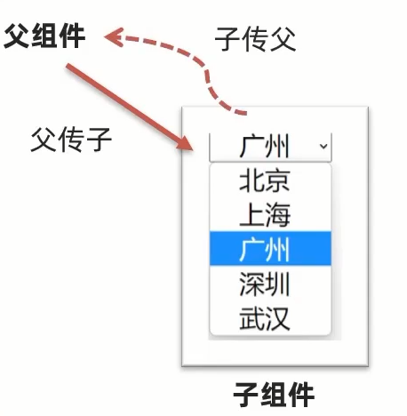

# v-model原理 & 表单类组件封装 & v-model简化代码

## v-model原理

v-model本质上是一个 **语法糖**.例如应用在输入框上,就是 **value属性** 和 **input事件** 的合写.

如果在输入框上,其他的表单组件会稍有不同,但是原理一致

`v-model="msg1"` 等同于 `:value="msg2" @input="msg2 = $event.target.value"`

数据发生改变,页面会自动变： **value**

页面输入改变,数据会自动变 **@input**

**$event** 用于在模板中,获取事件的形参

## 表单类组件封装

1. 父传子： 数据应该是父组件 **props** 传递 过来的,v-model **拆解** 绑定数据.
2. 子传父： 监听输入,子传父传值给父组件修改



### 子组件 (封装)

```html
<select :value="cityId" @change="handleChange">...</select>
```

```js
props: {
	cityId: String
}
```

```js
methods: {
	handleChange (e) {
		this.$emit( '事件名', e.target.value )
	}
}
```

### 父组件 (使用)

```html
<BaseSelect :cityId="selectId" @事件名="selecteId = $event">
```

## v-model简化代码

1. 子组件中： props 通过 **value** 接收，事件触发 **input**
2. 父组件中： **v-model** 给组件直接绑数据


### 子组件 (封装)

```html
<select :value="value" @change="handleChange">...</select>
```

```js
props: {
	value: String
}
```

```js
methods: {
	handleChange (e) {
		this.$emit( 'input', e.target.value )
	}
}
```

### 父组件 (使用)

```html
<BaseSelect :cityId="selectId" @input="selecteId = $event">
```