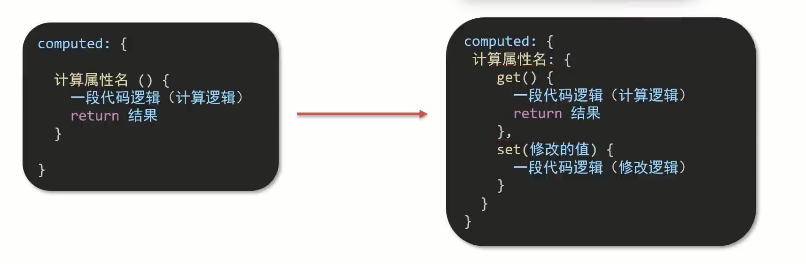

# 计算属性

## 概念

基于 **现有的数据**,计算出来的 **新属性**.**依赖** 的数据变化,**自动** 重新计算.

## 语法

1. 声明在 **computed 配置项** 中,一个计算属性对应一个函数
2. 使用起来和普通属性一样使用 `{{ 计算属性名 }}`

## 例子

```html
<div id="app">
	<h3>礼物清单</h3>
	<table>
		<tr>
			<th>名字</th>
			<th>数量</th>
		</tr>
		<tr v-for="(item, index) in list" :key="item.id">
			<td>{{ item.name }}</td>
			<td>{{ item.num }}个</td>
		</tr>
	</table>
	<p>礼物总数: ? 个</p>
</div>

<script src="https://cdn.jsdelivr.net/npm/vue@2.7.14/dist/vue.js"></script>

<script>
	const app = new Vue({
		el: '#app'，
		data: {
			list: [
				{ id: 1, name: '篮球', num: 1 },
				{ id: 2, name: '玩具', num: 2 },
				{ id: 3, name: '铅笔', num: 5 }
			]
		},
		computed: {
			totalCount () {
				// 基于现有的数据,编写求值逻辑
				// 计算属性函数内部,可以直接通过 this 访问到 app 实例
				// console.log(this.list);

				// 需求： 对 this.list 数组里面的 num 进行求和 → reduce
				let total = this.list.reduce((sum, item) => sum + item.num, 0)
				return total
			}
		}
	})
</script>
```

## computed 计算属性 vs methods 方法

computed 计算属性:
作用: 封装了一段时间对于 **数据** 的处理,求得一个 **结果**.
语法:
1. 写在 **computed** 配置项中
2. 作为属性，直接使用→ **this.计算属性** `{{ 计算属性 }}`

缓存特性(提升性能)：
计算属性会对计算出来的 **结果缓存**，再次使用直接读取缓存,依赖项变化了，会 **自动** 重新计算 → 并 **再次缓存**

methods 方法:
作用: 给实例提供一个 **方法**，调用以处理 **业务逻辑**。
语法:
1. 写在 **methods** 配置项中
2. 作为方法,需要调用 → `this.方法名() {{ 方法名() }} @事件名="方法名"`

## 计算属性的完整写法

计算属性默认的简写,只能读取访问,**不能"修改"**。
如果要 **"修改"** → 需要写计算属性的 **完整写法**。



### 例子

```html
<div id="app">
	姓: <input type="text" v-model="firstName"> + 
	名: <input type="text" v-model="lastName"> = 
</div>

<script src="https://cdn.jsdelivr.net/npm/vue@2.7.14/dist/vue.js"></script>
<script>
	const app = new Vue({
		el: '#app'，
		data: {
			firstName: '刘',
			lastName: '备',
		},
		methods: {
			changeName () {
				this.firstName = '吕小布'
			}
		},
		computed: {
			fullName: {
				// 当fullName计算属性，被获取求值时，执行get(有缓存，优先读缓存)
				// 会将返回值作为，求值的结果
				get () {
					return this.firstName + this.lastName
				},
				// 当fullName计算属性，被修改赋值时，执行set修改的值，传递给set方法的形参
				set () {
					// console.log(value.slice(0, 1))
					// console.log(value.slice(1))
					this.firstName = value.slice(0, 1)
					this.lastName = value.slice(1)
				}
			}
		}
	})
</script>
```