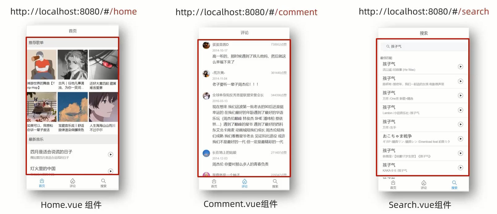
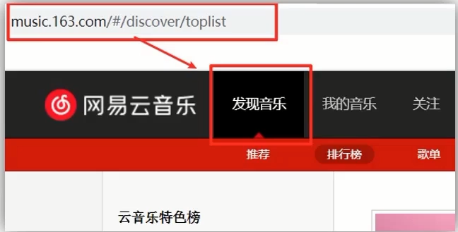
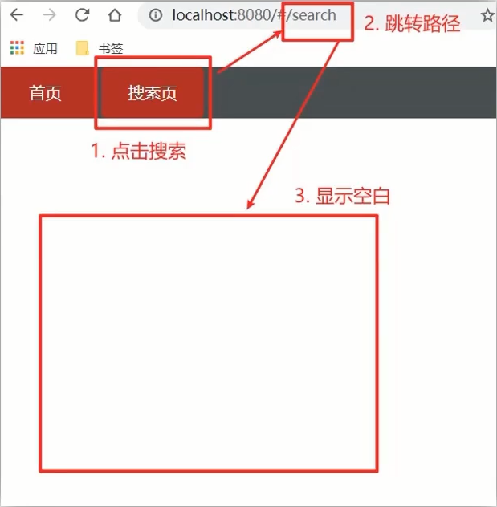

# 路由

生活中的路由：设备和ip的 **映射** 关系


Vue中路由: **路径** 和 **组件** 的 **映射** 关系



## VueRouter介绍

### 作用

**修改** 地址栏路径时,**切换显示** 匹配的 **组件**

### 说明

Vue 官方的一个路由插件,是一个第三方包

### 官网

[点击跳转](https://v3.router.vuejs.org/zh/)

### 使用 (5 + 2)

#### 5个基础步骤 (固定)

1.下载 VueRouter 模块到当前工程

Vue2 VueRouter3.x Vuex3.x
Vue3 VueRouter4.x Vuex4.x

```sh
npm install vue-router
```

2.引入

```js
import VueRouter from 'vue-router'
```

3.安装注册

```js
Vue.use(VueRouter)
```

4.创建路由对象

```js
const router = new VueRouter()
```

5.注入,将路由对象注入到new Vue实例中,建立关联

```js
new Vue({
	render: h => h(App),
	router
}).$mount('#app')
```

#### 2个核心步骤

1.创建需要的组件(views目录),配置路由规则

```js
const router = new VueRouter({
	routes: [
		{ path: '/find', component: Find }
	]
})
```

path 地址栏路径
component 组件

2.配置导航,配置路由出口(路径匹配的组件显示的位置)

```html
<div>
	<a href="#/find">发现</a>
</div>
<div>
	<router-view></router-view>
</div>
```

## 组件存放目录问题(组件分类)

组件分类: .vue文件分2类;页面组件 & 复用组件

都是 **.vue文件 (本质无区别)**

分类开来 **更易维护**

* src/views文件夹
  * **页面组件** - 页面展示 - 配合路由用
* src/components文件夹
  * **复用组件** - 展示数据 - 常用于复用


## 路由的封装抽离

一大堆配置和模块堆在main.js里,肯定不合适

将路由模块抽离出来.好处: **拆分模块**,**利于维护**

在 `/router/index.js` 里写路由

`main.js` 理要导入

```js
import router from './router/index'
```

`index.js` 里要导出

```js
export default router
```

> [!TIP]
> `@` 路径,可以代表 `/src` 目录
> 例如: `@/views/Find`

## 声明式导航

vue-router 提供了一个全局组件 router-link(取代 a 标签)

1. **能跳转**,配置to属性指定路径(**必须**).本质还是a标签,**to无需#**
2. **能高亮**,默认就会提供 **高亮类名**,可以直接设置高亮样式

会提供两个class `router-link-exact-active` 和 `router-link-active`

1. `router-link-active` 模糊匹配(用的多)
   1. `to="/my"` 可以匹配 `/my` `/my/a` `/my/b` `...`
2. `router-link-exact-active` 精确匹配
   1. `to="/my"` 仅可以匹配 `/my`



### 想自定义类名?当然可以!

```js
const router = new VueRouter({
	routes: [...],
	linkActiveClass: "模糊匹配的类名",
	linkExactActiveClass: "精确匹配的类名"
})
```

### 跳转传参

#### 查询参数传参

`to="/path?参数名=值"`

对应页面接收: `$route.query.参数名`

#### 动态路由传参

1.配置动态路由

```js
const router = new VueRouter({
	routes: [
		...,
		{
			path: '/search/:words',
			component: Search
		}
	]
})
```

2.配置导航链接

`to="/path/参数值"`

3.对应页面组件接收传递过来的值

`$route.params.参数名`

##### 参数可选符

问题: 配了路由 `path:"/search/:words"` 为什么按下面步骤操作,会未匹配到组件,显示空白?

原因: `/search/:words` 表示,必须要传参数.如果不传参数,也希望匹配,可以加个可选符 `?`



```js
const router = new VueRouter({
	routes: [
		...,
		{
			path: '/search/:words?',
			component: Search
		}
	]
})
```

#### 区别

1. 查询参数传参(比较适合传 **多个参数**)
   1. 跳转: `to="/path?参数名=值&参数名2=值"`
   2. 获取: `$route.query.参数名`
2. 动态路由传参(**优雅简洁**,传单个参数比较方便)
   1. 配置动态路由: `path:"/path/参数名"`
   2. 跳转: `to="/path/参数值"`
   3. 获取: `$route.params.参数名`

### 重定向

#### 语法

```js
{ path: 匹配路径, redirect: 重定向到的路径 }
```

#### 示例

```js
const router = new VueRouter({
	routes: [
		{
			path: '/',
			redirect: '/home'
		},
		{
			path: '/home',
			component: Home
		}
	]
})
```

#### 404

需要配置在整个路由最后面

##### 语法

```js
{ path: '*', component: NotFind }
```

##### 示例

```js
const router = new VueRouter({
	routes: [
		{
			path: '/',
			redirect: '/home'
		},
		{
			path: '/home',
			component: Home
		},
		{
			path: '*',
			component: NotFind
		}
	]
})
```

## 模式设置

hash 路由(默认)

例如:http://localhost:8080/#/home

history 路由(常用)

例如:http://localhost:8080/home(以后上线需要服务器端支持)

切换:

```js
const router = new VueRouter({
	route: [...],
	mode: "history"
})
```

## 基本跳转

搜索框之类的跳转

### path 路径跳转 (简单方便)

```js
this.$router.push('路由路径')
```

```js
this.$router.push({
	path: '路由路径'
})
```

### name 命名路由跳转 (适合路径长的)

```js
this.$router.push({
	name: '路由名'
})
```

```js
{ name: 'xxx' path: 'xxx', component: xxx }
```

```js
const router = new VueRouter({
	routes: [
		{
			name: '路由名'
			path: '/home/xxx',
			component: xxx
		}
	]
})
```

### 传参

#### 路径跳转 - query传参

```js
this.$router.push('/路径?参数1=值&参数2=值')
```

```js
this.$router.push({
	path: '/路径',
	query: {
		参数1: '值',
		参数2: '值'
	}
})
```

#### 路径跳转 - 动态路由传参

```js
this.$router.push('/路径/参数值')
```

```js
this.$router.push({
	path: '/路径/参数值',
})
```

#### 命名路径跳转 - query传参

```js
this.$router.push({
	name: '路由名字',
	query: {
		参数名1: '参数值1',
		参数名2: '参数值2'
	}
})
```

#### 命名路径跳转 - 动态路由传参

```js
this.$router.push({
	name: '路由名称',
	params: {
		参数名: '参数值'
	}
})
```

## 总结

1. path 路径跳转
   1. query 传参

	```js
	this.$router.push('/路径?参数1=值&参数2=值')
	```

	```js
	this.$router.push({
		path: '/路径',
		query: {
			参数名1: '参数值1',
			参数名2: '参数值2'
		}
	})
	```

	2. 动态路由传参 (需要配动态路由)

	```js
	this.$router.push('/路径/参数值')
	```

	```js
	this.$router.push({
		path: '/路径/参数值'
	})
	```

2. name 命名路由传参
   1. query 传参

	```js
	this.$router.push({
		name: '路由名称',
		query: {
			参数名1: '参数值1',
			参数名2: '参数值2'
		}
	})
	```

	2. 动态路由传参 (需要陪动态路由)

	```js
	this.$router.push({
		name: '路由名称',
		params: {
			参数名: '参数值',
		}
	})
	```

## 嵌套路由

通过在父路由里写 `children` 嵌套子路由

格式和父路由一致

### 例如

```js
const router = new VueRouter({
	routes: [
		{
			path: '/',
			component: Layout,
			// 子路由
			children: [
				path: '/children',
				component: Children,
			]
		}
	]
})
```

## 组件缓存 keep-alive

### 是什么

keep-alive 是Vue的内置组件,当它包裹动态组件时,会缓存不活动的组件实例,而不是销毁它们.

keep-alive 是一个抽象组件:它自身不会渲染成一个 DOM 元素,也不会出现在父组件链中.

### 优点

在组件切换过程中把切换出去的组件保留在内存中,防止重复渲染DOM,减少加载时间及性能消耗,提高用户体验性.

### 语法

包起`router-view`

```html
<template>
	<div>
		<keep-alive>
			<router-view></router-view>
		</keep-alive>
	</div>
</template>
```

### 三个属性

1.include:组件名数组,只有匹配的组件会被缓存

2.exclude: 组件名数组,任何匹配的组件都不会被缓存

3.max: 最多可以缓存多少组件实例最多可以缓存多少组件实例

没找到组件名,才会寻找文件名,组件名优先级更高

```html
<template>
	<div :include="[ '组件名' ]">
		<keep-alive>
			<router-view></router-view>
		</keep-alive>
	</div>
</template>
```

被缓存的组件,会多两个生命周期钩子

1. actived 激活时 - 组件被看见时
2. deactivd 失活时 - 离开页面组件看不见了时